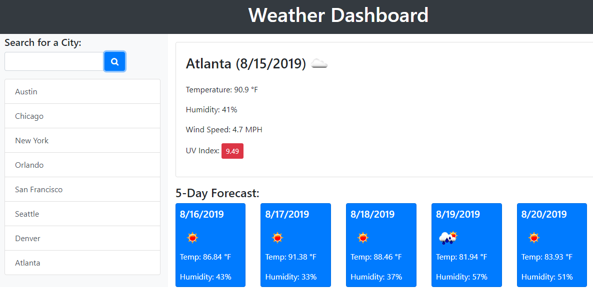

# hw-6-weather-dashboard
Weather dashboard for major cities

### [View Deployed Site](https://cranky-brattain-60efb5.netlify.app/)

## Goal 
Create a website that uses the [Open Weather API](https://openweathermap.org/api) to display the current weather and a 5 day forecast, based on the location a user inputs.

I took the project a step further by re-imaging the layout and design, but still using most of the fundamental features that were given. (Main future feature will be to add a search history that store's it's search results in local storage.)

### Original Mockup That Was Provided 

### New Design

## Key Highlights 
* Search input field grows in size, when "focused" on

* Custom Design that is also responsive 

* Most of the result and location results are dynamically being generated by JavaScript

* Built in React.js, uses Axios for API calls and Bulma for the css framework

* Weather data is being pulled from the Open Weather API, using 2 different endpoints
    * Current Weather 
    * 3 Hour / 5 Day Forecast 

* Current weather pulls a random background image from the Unsplash API, based on search input.

## Future Additions
* Adding Local Storage Feature
* Adding a "Clear" **x** button to remove individual saved locations 
* Adding a "Clear All" button to remove all locations
* Refining layout for the 5 Day Forecast columns, so they wrap at a larger breakpoint 
* Adding in the local storage feature

